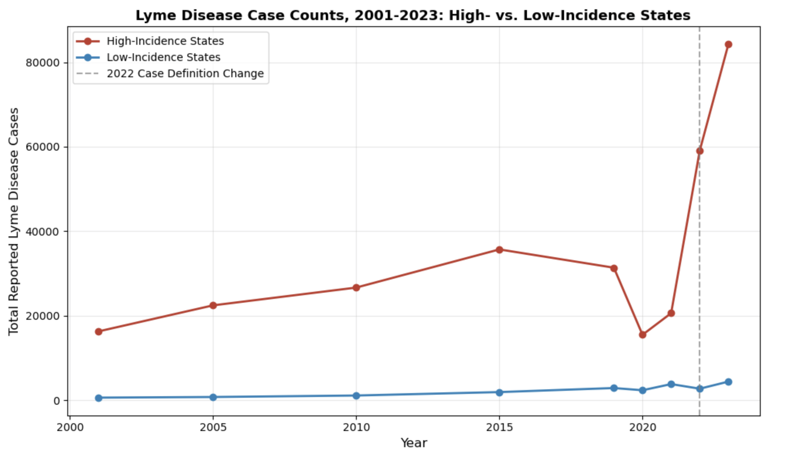

# Lyme Disease Risk Pattern Analysis

## Research Question

Does official Lyme disease case data reliably reflect actual disease risk, or does it under-represent cases in ways that vary systematically by geography, reporting methodology, and rurality?

This project combines CDC tick surveillance data with CDC Lyme disease case data, U.S. Census population estimates, and NCHS urban-rural classifications to test two specific, measurable hypotheses about how well official surveillance data reflects true disease risk.

## Data Sources

This analysis draws on four public datasets. CDC's Lyme Disease Data and Surveillance program provided county-level reported case counts spanning 2001 to 2023. CDC's Tick Surveillance Data Sets provided county-level establishment status for Ixodes scapularis and Ixodes pacificus, the two tick species responsible for the vast majority of Lyme disease cases in the United States. The U.S. Census Bureau provided county-level population estimates for 2020 through 2025. Finally, the NCHS Urban-Rural Classification Scheme provided a six-level classification for each county, ranging from large central metro to noncore, or rural.

## Methodology

A relational database was designed in Oracle SQL, linking five tables through a standardized five-digit FIPS county code. The core table holds county and state names, with four related tables holding annual case counts and incidence classification, tick establishment status by species, population estimates, and urban-rural classification.

Each data source needed its own cleaning before it could be joined to the others. This included fixing character encoding issues that caused special characters in state and municipality names to break standard parsing, building standardized FIPS codes from separate state and county code columns, and removing state-level summary rows before matching at the county level. One county required a manual fix: Shannon County, South Dakota was renamed Oglala Lakota County in 2015, and its FIPS code changed accordingly, so this had to be corrected before the tick and case data would match. Connecticut was excluded entirely from the tick-status comparison, since its tick surveillance data is organized by nine planning regions while its case data still uses the traditional eight counties, and the two systems don't map cleanly onto each other.

After cleaning, match rates were strong: 3,110 of 3,153 counties matched between the case and tick data, and 3,143 of 3,144 matched for the population and urban-rural data.

Case counts were converted to rates per 100,000 residents, rather than left as raw counts, so counties of different sizes could be fairly compared. Tick surveillance data reflects a cumulative, current status rather than any single collection year, so the four most recent case-data years, 2020 through 2023, were used as the closest reasonable comparison window.

## Finding One: The 2022 Case Definition Change Coincides With a Reporting Spike

In 2022, states the CDC designates as high-incidence adopted a stricter case definition requiring laboratory confirmation, while low-incidence states continued using a broader definition that also allows clinical diagnosis without a lab test. This policy change, and its documented effect on national case counts, is described directly in CDC surveillance literature.

This project independently measured that effect using the county-level dataset built for this analysis. Looking only at counties with established tick populations, average case counts in high-incidence states rose from 40.6 in 2021 to 116.3 in 2022, an increase of roughly 186 percent. Low-incidence states moved in the opposite direction over the same period, falling from an average of 3.8 to 2.7 cases.

The increase is concentrated almost entirely in high-incidence states, exactly the group whose case definition changed, while low-incidence states show no comparable jump. This project cannot fully rule out other contributing factors, but the precise alignment in both timing and geography with a documented, dated policy change makes a reporting artifact the most consistent explanation for the spike.

## Finding Two: Rural Counties Show a Measured Pattern of Zero-Case Reporting Despite Confirmed Tick Presence

Among counties with confirmed, established tick populations, a meaningful share report zero Lyme disease cases across all four analysis years despite documented vector presence. This project measured how that pattern changes with a county's rurality.

Large central metro counties showed a zero-case rate of just 2.6 percent among established-tick counties. That rate rose steadily with rurality: 11.9 percent in large fringe metro counties, 17.2 percent in medium metro counties, 16.3 percent in small metro counties, 20.1 percent in micropolitan counties, and 33.4 percent in noncore, or rural, counties. Rural counties are roughly thirteen times more likely to show zero reported cases despite confirmed tick establishment than large central metro counties.

A separate but related pattern held for incidence classification: low-incidence states showed a zero-case rate of 34.1 percent among established-tick counties, compared to just 0.6 percent in high-incidence states.

It's important to be precise about what this project can and cannot conclude here. It measured a clear, statistically consistent association between rurality, low-incidence classification, and zero-case reporting in counties with confirmed tick presence. It did not measure why that association exists. Reduced healthcare access and lower clinical suspicion of Lyme disease in non-endemic-adjacent areas are both plausible explanations, but no healthcare access, provider density, or diagnostic behavior data was collected or tested as part of this analysis. These explanations are offered here as hypotheses worth testing in future work, not as measured findings.

## Limitations

Tick establishment data is not tied to a specific year. It reflects cumulative surveillance current as of 2025, with 83 percent of counties classified using historic or undated sources, and the remainder dated anywhere from 2004 to 2025. It is compared here against case data through 2023, the closest reasonable proxy available, though that comparison is inherently approximate.

Case data itself ends in 2023, two years before the tick data's reference point. Since tick establishment is a slow-changing biological reality rather than something that shifts year to year, this gap is not expected to meaningfully affect the comparison, but it's worth stating.

Case counts are recorded by a patient's county of residence rather than the location where exposure actually occurred, per CDC's own documentation, which means travel-related cases may be attributed to counties with little real tick exposure risk.

Tick surveillance itself is a passive system that depends on who happens to submit samples for testing. A "no records" classification does not confirm ticks are truly absent from a county, only that no one has documented them there.

Connecticut is excluded from the tick-status comparison for the geographic reasons described above.

Finally, this analysis is correlational, not causal, and no explanatory mechanism was directly measured. The rural and low-incidence zero-case patterns are robust and well-supported by the data. Healthcare access and clinical awareness remain plausible but untested explanations for why those patterns exist.

## Future Work

A natural next step would be testing explanatory factors for the rural and low-incidence reporting gap more directly, using measures like physicians per capita, hospital density, or insurance coverage by county, rather than relying on rurality as an association without a tested explanation. Incorporating case data through 2024 and 2025 as it becomes available would also help close the current gap with the tick data's reference period. Finally, extending the analysis to the pathogen-presence tick dataset, rather than establishment status alone, could reveal whether confirmed pathogen detection shows a similar rural reporting gap.

## Repository Contents

This repository includes the Jupyter notebook containing the full data cleaning and preparation process, the SQL file containing the complete database schema and analysis queries, and the case trend visualization referenced above.
